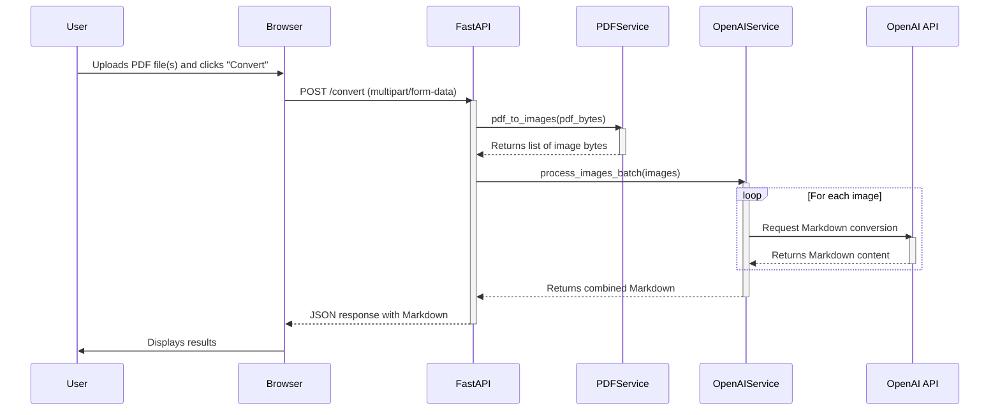

# Contribute to modul8r

Fork the repository, clone it locally, and install the development dependencies.

### 1. Fork and clone the repo

Fork the repository and clone it locally:

```shell
git clone [https://github.com/mmacy/modul8r.git](https://github.com/mmacy/modul8r.git)
cd modul8r
```

### 2. Install development dependencies

Install development dependencies:

```shell
uv sync --dev
```

To run web UI tests, install the Playwright browser drivers:

```shell
playwright install
```

## Making changes

### 1. Create a branch

Create a descriptive branch for your feature or bug fix.

```shell
git checkout -b my-awesome-feature
```

### 2. Write code

Write code that adheres to project style and quality standards.

### 3. Run quality checks

Run code quality checks before committing:

```shell
# Format code
uv run ruff format

# Lint code
uv run ruff check --fix

# Type check
uv run mypy src/
```

### 4. Run tests

Run the main test suite (all tests except E2E):

```shell
uv run pytest -m "not e2e"
```

See the Testing section for details.

### 5. Commit your changes

Commit changes using the conventional commit message format.

```shell
git commit -m "feat: Add new conversion option for detail level"
```

## Testing

The project includes unit, API, web UI, and end-to-end (E2E) tests. E2E tests make live OpenAI API calls and require an `OPENAI_API_KEY`.

### Running all tests

Run the entire test suite, including E2E tests:

```shell
uv run pytest
```

### Running specific tests

Run specific test suites by path or marker:

```shell
# Run all tests except E2E tests
uv run pytest -m "not e2e"

# Run only service unit tests
uv run pytest tests/test_services.py

# Run only API tests
uv run pytest tests/test_main.py

# Run only web UI tests
uv run pytest tests/test_playwright.py
```

### Running E2E tests

Run only E2E tests (requires `OPENAI_API_KEY`):

```shell
# Run only E2E tests
uv run pytest -m e2e
```

## Submitting a pull request

Push your branch and open a pull request against `main`.

- Use a clear title and description.
- Reference relevant issues.
- Ensure CI checks pass.

## Architecture overview

`modul8r` is a FastAPI application with a vanilla JavaScript frontend that converts PDF files to Markdown.

### Components

- **`main.py`**: FastAPI application entry point, routes, and WebSocket endpoint.
- **`services.py`**: Core business logic.
    - `PDFService`: Converts PDF files to images using `pdf2image`.
    - `OpenAIService`: Manages OpenAI API interaction, including concurrency, retries, and vision model parameters.
- **`config.py`**: Manages application configuration via `pydantic-settings` from environment variables and `.env` files.
- **`logging_config.py`**: Configures `structlog` for structured logging and WebSocket streaming.
- **`websocket_handlers.py`**: Manages WebSocket connections and log broadcasting.
- **`performance_monitor.py`**: Monitors the asyncio event loop for performance degradation.
- **`templates/index.html`**: Single-page vanilla HTML/CSS/JS frontend.

### Request flow

`/convert` request flow:


