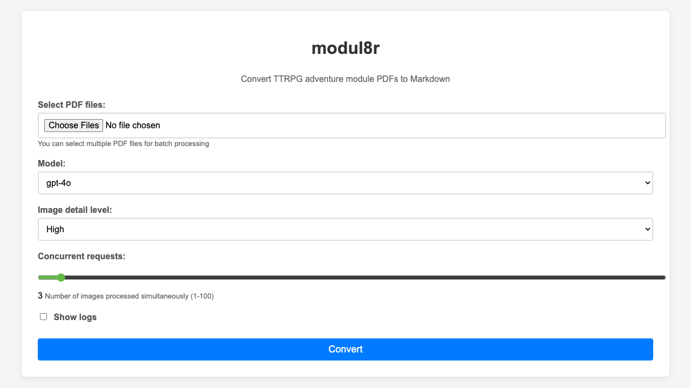

# modul8r

Web service that converts PDF files to Markdown using OpenAI vision models.

modul8r converts PDF pages to images and sends them to OpenAI's vision models for text extraction and Markdown conversion. Uses FastAPI backend with WebSocket log streaming.



## Features

- PDF to image conversion using pdf2image
- OpenAI vision model integration with automatic o-series parameter handling
- Concurrent page processing using Python 3.13 TaskGroup (1-100 concurrent requests)
- WebSocket log streaming for real-time processing visibility
- Partial result recovery when some pages fail processing
- Configurable concurrency and processing parameters

## Prerequisites

- Python 3.13 or higher
- OpenAI API key
- [Poppler](https://poppler.freedesktop.org/)
  - **macOS**: `brew install poppler`
  - **Ubuntu/Debian**: `apt-get install poppler-utils`

## Installation

```bash
# Clone the repository
git clone https://github.com/mmacy/modul8r.git
cd modul8r

# Install dependencies
uv sync --dev

# Install browser drivers for testing (optional)
playwright install
```

## Configuration

Set your OpenAI API key:

```bash
export OPENAI_API_KEY="your-api-key-here"
```

Or create a `.env` file:

```
OPENAI_API_KEY=your-api-key-here
```

## Running the application

```bash
uv run python -m src.modul8r.main
```

The web interface will be available at http://127.0.0.1:8000

## Usage

### Web interface

1. Navigate to http://127.0.0.1:8000
2. Upload PDF file(s)
3. Select OpenAI model (latest non-reasoning model is recommended)
4. Set detail level (low/high - defaults to high)
5. Set concurrency (1-100 - defaults to 64)
6. Select **Convert**
7. View processing logs via WebSocket connection
8. Receive JSON response with converted Markdown

### API endpoints

#### GET /models

Returns available OpenAI vision models:

```bash
curl http://localhost:8000/models
```

#### POST /convert

Convert PDF files to Markdown (accepts multipart form data):

```bash
curl -X POST \
  -F "files=@document.pdf" \
  -F "model=gpt-4.1-nano" \
  -F "detail=high" \
  -F "concurrency=16" \
  http://localhost:8000/convert
```

Returns JSON: `{"filename.pdf": "converted markdown content"}`

#### GET /config

Returns current configuration settings:

```bash
curl http://localhost:8000/config
```

Returns JSON with key configuration values like max_concurrent_requests, openai_default_model, pdf_dpi, etc.

#### GET /status

Application health check and status:

```bash
curl http://localhost:8000/status
```

Returns application health status, version, and basic settings.

#### GET /status/phase1 (Optional)

Phase 1 foundation safeguards monitoring endpoint (enabled by default):

```bash
curl http://localhost:8000/status/phase1
```

Returns detailed monitoring statistics including message throttling, memory management, and performance metrics.

#### WebSocket /ws/logs

Real-time log streaming:

```javascript
const ws = new WebSocket('ws://localhost:8000/ws/logs');
ws.onmessage = (event) => {
  const data = JSON.parse(event.data);
  // Message types: log_entry, log_history, status_update, pong
};
```

## Configuration

Configuration via environment variables (most use `MODUL8R_` prefix):

### OpenAI settings

- `OPENAI_API_KEY` - Your OpenAI API key (uses alias, no prefix)
- `MODUL8R_OPENAI_DEFAULT_MODEL` - Default model (default: "gpt-4.1-nano")
- `MODUL8R_OPENAI_MAX_TOKENS` - Max tokens per request (default: 100000)
- `MODUL8R_OPENAI_TEMPERATURE` - Temperature setting (default: 0.1)
- `MODUL8R_OPENAI_TIMEOUT` - Request timeout in seconds (default: 60.0)

### Processing settings

- `MODUL8R_MAX_CONCURRENT_REQUESTS` - Concurrent processing limit (default: 3, range: 1-100)
- `MODUL8R_PDF_PROCESSING_TIMEOUT` - Overall processing timeout (default: 300.0)
- `MODUL8R_PDF_DPI` - Image resolution for PDF conversion (default: 300, range: 150-600)
- `MODUL8R_PDF_FORMAT` - Image format (default: "PNG")
- `MODUL8R_RETRY_MAX_ATTEMPTS` - Max retry attempts (default: 1)
- `MODUL8R_RETRY_BASE_DELAY` - Base retry delay in seconds (default: 1.0)
- `MODUL8R_RETRY_MAX_DELAY` - Max retry delay in seconds (default: 60.0)

### Logging settings

- `MODUL8R_LOG_LEVEL` - Logging level (default: "INFO")
- `MODUL8R_LOG_FORMAT` - Log format (default: "json")
- `MODUL8R_LOG_CORRELATION_ID_HEADER` - Correlation ID header (default: "X-Correlation-ID")
- `MODUL8R_ENABLE_LOG_CAPTURE` - Enable WebSocket log streaming (default: true)

### Phase 1 Foundation Safeguards

The application includes Phase 1 foundation safeguards with message throttling, enhanced memory management, and performance monitoring:

#### Message Throttling Settings
- `MODUL8R_THROTTLE_BATCH_INTERVAL` - Batch interval in seconds (default: 0.5, range: 0.1-5.0)
- `MODUL8R_THROTTLE_MAX_BATCH_SIZE` - Max messages per batch (default: 100, range: 10-500)
- `MODUL8R_THROTTLE_CIRCUIT_BREAKER_THRESHOLD` - Messages/sec threshold (default: 50.0, range: 10.0-200.0)
- `MODUL8R_THROTTLE_CIRCUIT_BREAKER_WINDOW` - Window in seconds (default: 10.0, range: 5.0-60.0)
- `MODUL8R_THROTTLE_CIRCUIT_BREAKER_RECOVERY_TIME` - Recovery time in seconds (default: 30.0, range: 10.0-300.0)

#### Memory Management Settings
- `MODUL8R_ENHANCED_LOG_CAPTURE_MAX_ENTRIES` - Max log entries (default: 1000, range: 100-5000)
- `MODUL8R_ENHANCED_LOG_CAPTURE_MAX_AGE_SECONDS` - Max log age in seconds (default: 3600, range: 300-86400)
- `MODUL8R_ENHANCED_LOG_CAPTURE_CLEANUP_INTERVAL` - Cleanup interval in seconds (default: 300, range: 60-1800)

#### Performance Monitoring Settings
- `MODUL8R_PERFORMANCE_MONITOR_MAX_LAG_MS` - Event loop lag threshold in ms (default: 40.0, range: 10.0-200.0)
- `MODUL8R_PERFORMANCE_MONITOR_CHECK_INTERVAL` - Check interval in seconds (default: 1.0, range: 0.5-10.0)
- `MODUL8R_PERFORMANCE_MONITOR_SEVERE_LAG_THRESHOLD_MULTIPLIER` - Severe lag multiplier (default: 3.0, range: 2.0-10.0)
- `MODUL8R_PERFORMANCE_MONITOR_MAX_SEVERE_LAG_COUNT` - Max severe lag count (default: 5, range: 1-20)

#### Feature Flags
- `MODUL8R_ENABLE_MESSAGE_THROTTLING` - Enable message throttling (default: true)
- `MODUL8R_ENABLE_ENHANCED_MEMORY_MANAGEMENT` - Enable enhanced memory management (default: true)
- `MODUL8R_ENABLE_PERFORMANCE_MONITORING` - Enable performance monitoring (default: true)
- `MODUL8R_ENABLE_PHASE1_STATUS_ENDPOINT` - Enable Phase 1 status endpoint (default: true)

### Server settings

- `MODUL8R_SERVER_HOST` - Server host (default: "127.0.0.1")
- `MODUL8R_SERVER_PORT` - Server port (default: 8000)
- `MODUL8R_SERVER_RELOAD` - Enable auto-reload (default: false)

### WebSocket settings

- `MODUL8R_WEBSOCKET_TIMEOUT` - WebSocket timeout in seconds (default: 60.0)
- `MODUL8R_WEBSOCKET_PING_INTERVAL` - Ping interval in seconds (default: 20.0)

## Development

### Running tests

```bash
# Run all tests
uv run pytest

# Run specific test suites
uv run pytest tests/test_services.py    # Unit tests
uv run pytest tests/test_main.py        # API tests
uv run pytest tests/test_playwright.py  # Web UI tests

# Run E2E tests (requires OPENAI_API_KEY)
uv run pytest tests/test_e2e_playwright.py -m e2e
```

### Code quality

```bash
# Lint code
uv run ruff check

# Format code
uv run ruff format

# Type checking
uv run mypy src/
```

### Project structure

```
modul8r/
├── src/modul8r/          # Main application code
│   ├── main.py           # FastAPI application and routes
│   ├── services.py       # OpenAI and PDF processing services
│   ├── config.py         # Configuration management
│   ├── logging_config.py # Structured logging setup
│   ├── websocket_handlers.py  # WebSocket connection management
│   └── performance_monitor.py # Phase 1 performance monitoring
├── templates/           # Jinja2 HTML templates
├── tests/               # Test suites (includes E2E with Playwright)
├── docs/                # Project documentation
├── playwright-e2e/      # E2E test configuration and PDF files
├── pyproject.toml       # Project dependencies and configuration
└── CLAUDE.md            # Development guidance
```

## Architecture

### Components

- FastAPI web framework
- AsyncOpenAI client with model detection and parameter handling
- pdf2image for PDF to PNG conversion at configurable DPI
- Python 3.13 TaskGroup for concurrent page processing
- WebSocket server for log streaming with Phase 1 foundation safeguards
- Structured logging with request correlation and enhanced memory management
- Phase 1 foundation safeguards including message throttling and performance monitoring

### Processing flow

1. Accept PDF files via multipart form upload
2. Convert PDF pages to images using pdf2image
3. Base64 encode images for OpenAI API
4. Process pages concurrently using TaskGroup and semaphore rate limiting
5. Send images to OpenAI vision model with structured prompt
6. Collect successful page results, skip failed pages
7. Return JSON response mapping filenames to Markdown content

### WebSocket logging

- Streams structured logs to connected clients
- Message types: log_entry, log_history, status_update, pong
- Includes request correlation IDs and deduplication
- Configurable via MODUL8R_ENABLE_LOG_CAPTURE

## Troubleshooting

### Common issues

**Import errors or missing dependencies:**

```bash
uv sync --dev
```

**PDF conversion fails:**
- Ensure poppler-utils is installed
- Check PDF file permissions and format

**OpenAI API errors:**
- Verify your API key is set correctly
- Check your OpenAI account usage and limits
- Some models may not be available in your region

**WebSocket connection issues:**
- Check firewall settings for localhost connections
- Ensure browser supports WebSockets

**Memory issues with large PDFs:**
- Reduce concurrency setting
- Process files individually rather than in batches
- Consider using lower DPI settings

### Performance tuning

- Adjust `MODUL8R_MAX_CONCURRENT_REQUESTS` (default: 3, max: 100)
- Lower `MODUL8R_PDF_DPI` for faster processing (default: 300, min: 150)
- Use "low" detail level for OpenAI vision processing
- Note: retry_max_attempts is set to 1 to prevent retry loops
